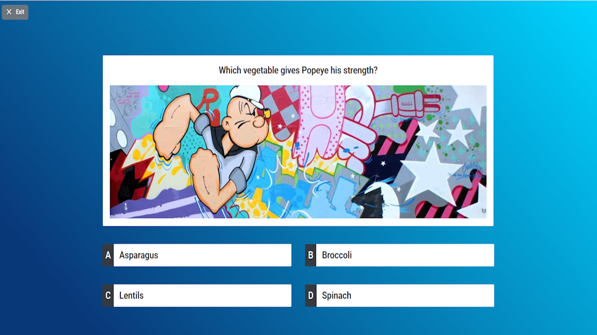

# Quiz Mate

Un moteur de quiz auto-hébergé léger pour exécuter des quiz interactifs en temps réel dans le navigateur. Ce projet est un fork de [Quiz Mate](https://github.com/david-04/quiz-mate) de David-04 qui basé sur [Quizario](https://github.com/adan2013/Quizario) de Daniel Alberski.


Pour plus de captures d'écran et une présentation complète, veuillez faire défiler vers le bas de cette page.

## Overview

Quiz Mate permet d'organiser facilement des quiz à choix multiples lors de réunions et de visioconférences. L'hôte active les questions une par une. Lorsqu'une question est active, les joueurs peuvent soumettre leurs réponses dans leur navigateur. L'hôte peut ensuite révéler la bonne réponse, afficher les statistiques et le classement, avant de passer à la question suivante.

## Features

- Application autonome (incluant le serveur web et l'interface utilisateur, aucune base de données requise)
- Facile à exécuter localement (nécessite uniquement Node.js) ou dans Docker
- Interaction en temps réel entre l'hôte et les joueurs (via des web sockets)
- Prise en charge des questions à choix multiples avec jusqu'à 4 réponses
- Chaque question peut inclure une image (affichée sur l'écran de l'hôte et celui du joueur)
- Les quiz sont stockés localement/hors ligne au format « JSON »
- Options de chronométrage et de lecture aléatoire, statistiques des réponses, classement et inscription facile via QR code
- Aucune gestion ni authentification des utilisateurs requise (toute personne disposant d'un lien peut héberger et rejoindre les quiz)
- Compatible HTTP et HTTPS
  
## Development

La documentation ci-dessous est destinée aux utilisateurs souhaitant exécuter l'application et héberger des quiz. Si vous êtes développeur et souhaitez apporter des modifications au code, consultez [DEVELOPMENT.md](https://github.com/papaeng89/quiz-mate/blob/main/DEVELOPMENT.md) instead.

## Installation and usage (locally without Docker)

Le Quiz Mate peut être exécuté directement (sans l'installer définitivement) en utilisant `npx` :

```sh
npx --yes quiz-mate
```

`npx` télécharge automatiquement l'application dans un répertoire temporaire et l'exécute depuis celui-ci. Pour des cas d'utilisation autres que l'essai, installez l'application dans le répertoire de travail actuel et exécutez-la depuis celui-ci :

```sh
npm install quiz-mate
npx quiz-mate
```

Au premier démarrage, un fichier de configuration est créé. Il s'appelle « quiz-mate.cfg » et contient des paramètres tels que le port HTTP. Vérifiez le fichier généré et ajustez les paramètres si nécessaire. Sur les systèmes UNIX, tous les ports inférieurs à « 1024 » sont privilégiés. Exécutez Quiz Mate en tant que superutilisateur (via « sudo ») ou utilisez un port non standard (par exemple, « 8080 »).

Après avoir vérifié la configuration, redémarrez Quiz Mate. Une fois le serveur opérationnel, l'interface web est accessible depuis votre navigateur :

```sh
# when using port 80
http://localhost/

# when using another port (e.g., 8080)
http://localhost:8080/
```

Lorsque vous exécutez Quiz Mate sur un ordinateur local, les connexions entrantes sont généralement bloquées par défaut. Pour permettre à d'autres utilisateurs d'accéder au serveur web via Internet, ouvrez le(s) port(s) correspondant(s) dans le(s) pare-feu du routeur et/ou du système d'exploitation.

Veuillez également consulter la section « Limites et contraintes opérationnelles » ci-dessous. Elle met en évidence certains pièges importants à prendre en compte.

## Installation and usage (Docker)

The Quiz Mate can be run in Docker using the supplied `Dockerfile`:

```sh
# build the Docker image
curl --silent https://david-04.github.io/quiz-mate/Dockerfile | docker build -t quiz-mate -

# run the application (replace "80" with the preferred host port to bind to)
docker run --rm -it -p 80:8080 quiz-mate
```

On UNIX systems, all ports below `1024` are privileged. Either run the Quiz Mate as a superuser via `sudo` (which might or might not work in conjunction with Docker) or use a non-standard port (e.g., `8080` instead of `80`).

Once the server is up and running, the web frontend can be accessed in the browser:

```sh
# when using port 80
http://localhost/

# when using another port (e.g., 8080)
http://localhost:8080/
```

The Docker image uses the current Node.js long-term support version and the latest Quiz Mate version from the NPM package registry. It's preconfigured as follows:

- The `HTTP` server runs on port `8080` (inside the container; can be mapped to any other port on the host).
- `HTTPS` is disabled.
- Static assets are served locally (from the container).

The Dockerfile also provides build arguments and environment variables to customize the Quiz Mate configuration. Please see the documentation on top of the [Dockerfile](https://github.com/david-04/quiz-mate/blob/main/docs/Dockerfile) for details.

The configuration file can be stored and maintained on the host (outside of the Docker container):

```sh
# mount a local config directory into the container when running the application
docker run --rm -it -p 80:8080 --volume .:/config quiz-mate
```

When started for the first time, the `docker run` command will create the configuration file `quiz-mate.cfg` in the current working directory (`.`). This configuration file can be freely edited (including enabling `HTTPS`). After reviewing the configuration, start the Quiz Mate again.

When running the Quiz Mate on a local computer, incoming connections are usually blocked by default. To let others access the web server over the internet, open the respective port(s) in the router's and/or operating system's firewall(s).

Please also review the _"Limitations and operational constraints"_ section below. It highlights some important pitfalls to be aware of.

## Limitations and operational constraints

Due to how the Quiz Mate is designed, there are some limitations to be aware of:

- The backend server stores data only in memory.
  - When the server stops, all running quizzes are terminated. They can't be resumed. The server must run continuously while quizzes are in progress.
  - The host and all players must connect to the same Quiz Mate instance. It is not possible to run and load-balance across multiple parallel instances.
  - For the reasons stated above, the Quiz Mate can't run in cluster environments like Kubernetes, where an orchestrator process could stop and restart instances at any time.
- Some quiz data is only kept in the host's browser session and not sent to the backend server at all. At the same time, hosts can't re-join a quiz after dropping out.
  - When the host accidentally leaves a quiz (for example, by closing the browser tab), the quiz is terminated and can't be resumed.
  - The same applies when the hosts' connection to the backend server drops. This could be caused by a flaky internet connection. It also happens when the browser tab is moved to the background and suspended/put to sleep by the browser. In those cases, the quiz is terminated and can't be resumed.
  - Unlike the host, players can rejoin after a connection loss. However, they won't be able to see the current question. They can only resume participating when the next question starts.
- There is no visual indication when a quiz is terminated prematurely (as described above).
  - Players won't get a notification and will continue to see the "Waiting for the next question" screen.
  - The host won't receive any notification either. The Quiz Mate will appear to be working as usual, allowing the host to proceed from question to question. The problem only becomes apparent when no answers are submitted (visible through the counter above the question).
- The server only purges quiz data from memory when the host properly ends the quiz (by showing the final leaderboard).
  - Quiz data is not deleted when the host accidentally leaves the quiz (e.g., by closing the browser tab). This can lead to memory leaks. Consider scheduling regular restarts when running the Quiz Mate continuously in a hosting environment. But also be aware that restarting the Quiz Mate will terminate all running quizzes. They can't be resumed.
  - There is no memory leak when the host ends the quiz properly. This can be done at any time through the `End quiz` button on the upper left-hand side of the screen.

- The Quiz Mate does not support authentication or user management. Everyone who knows the URL can access the web server and host quizzes. There is no authentication for players either. But at least they need the quiz code to join, making it slightly harder to gate-crash a quiz as an uninvited guest.

## Screenshots and walk-through

The Quiz Mate features a dedicated [quiz editor](https://david-04.github.io/quiz-mate/frontend/#/editor). Each question can have up to 4 answers and contain an optional image to display on the host screen:


The quiz editor does not store quizzes on the server. After creating a quiz, the host must download and store it locally (as a `JSON` file). An existing quiz can be modified by re-uploading it to the quiz editor.

The `JSON` file also needs to be uploaded every time the quiz is to be hosted. The host can optionally set a time limit for submitting answers. The questions can be played in their original order (as created in the quiz editor), or they can be shuffled (played in randomized order):


The host screen now displays instructions for players on how to join (and indicates how many players have joined so far):


Players can scan the QR code or enter the URL in their web browser. They join the quiz by picking a nickname and entering the access code (which is usually pre-populated):


After joining the quiz, players see a confirmation in their browser:


When the quiz commences, the host's screen displays a reminder, asking the players to look at their browser:


The host can now reveal the first question:


Players can see the question (albeit without the image) in their browser and submit their guesses by clicking on one of the answers:



Once an answer has been selected, the player's screen pauses until the round ends:


Guesses can be submitted until the host ends the round or (if enabled) until the timeout is reached. As soon as the round ends, the players can see if their answer was right:


If a player's guess was wrong, the correct answer is displayed as well:


The host can highlight the right answer and show answer statistics:


After each question, the host can also display the leaderboard. The players are ranked by the number of correct answers. Players with the same number of correct answers are sorted by their average answer speed:


The leaderboard is also displayed at the end, when the host ends the quiz. When this happens, each player can see their individual result:


